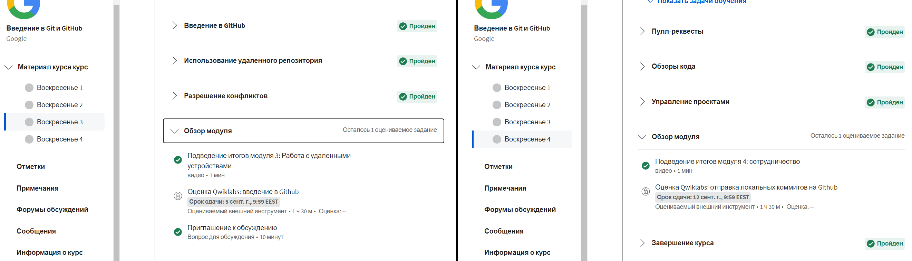
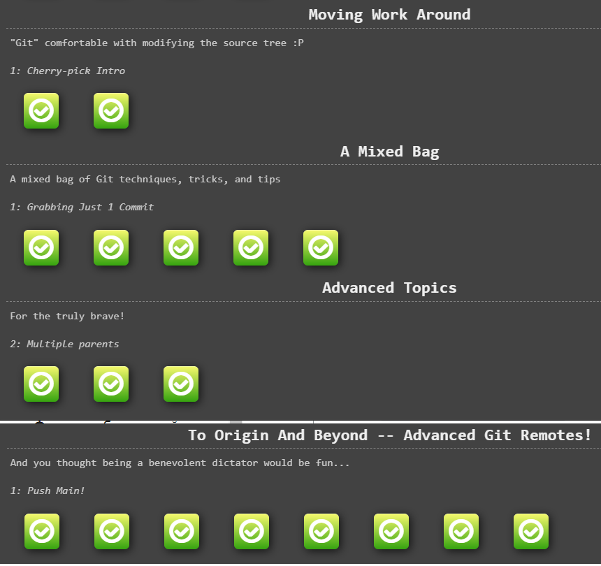
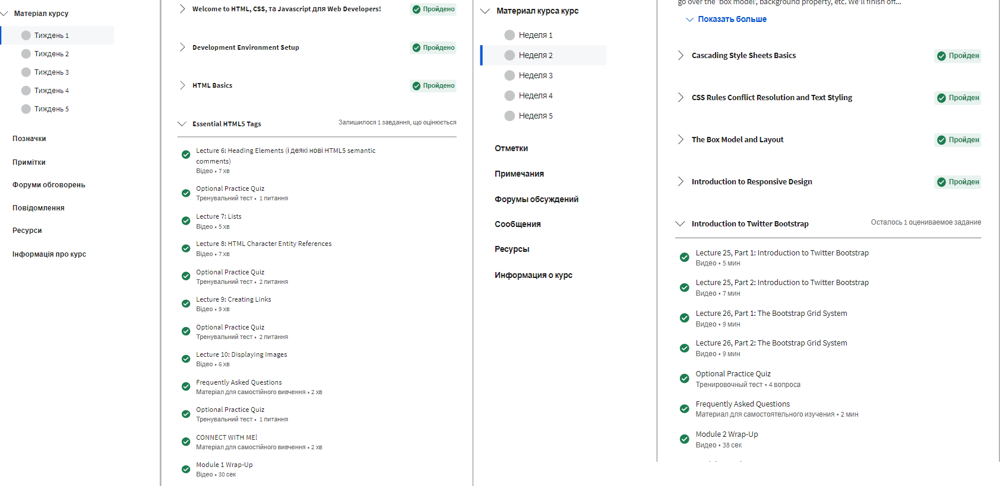
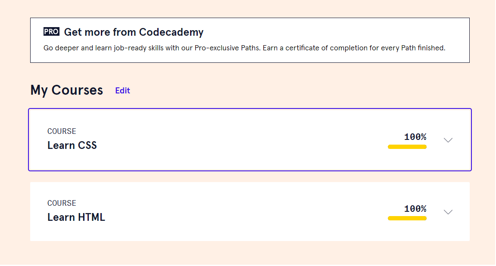

# kottans-frontend

## Git & Github

Passing the course from kottans front-end
Now i can say that the course is well written and structured.

Although I've only just started going through it, I've already learned a lot.
I liked the preparation process and practical tasks. I hope this will help me finish all the tasks in time.

A lot of the material was new to me;
Surprised how many options there are to solve the problem;
I will use the command git pool  the most in the future);

 Thank you for the opportunity, I will continue 

## Linux CLI, and HTTP

 Click to expand Screenshots from Linux Survival 

- The concept of HTTP Reques was completely new to me. Although I did not remember everything to the end, I understood the principle. I will try harder to remember.
- Surprised at how easy it was to do the Linux Survival exercises.
- In the future, I want to work more with HTTP Request. I hope to improve the knowledge about him

## Git Collaboration

 Click to expand Screenshots from coursera 3 & 4 weeks 

 Click to expand Screenshots from  learngitbranching 

- New for me this time was the flexibility of commits.
- I was surprised by git ability to catch errors.
- In the future, I will use the knowledge of git rebase and as much information as possible from this step of the course.

## Intro to HTML and CSS

 Click to expand Screenshots for Intro to HTML & CSS  

 Click to expand Screenshots from  codeAcademy 

- New was calling child selectors through parents.
- I was surprised by the variety of approaches to creating color.
- I will use Twitter Bootstrap more in the future