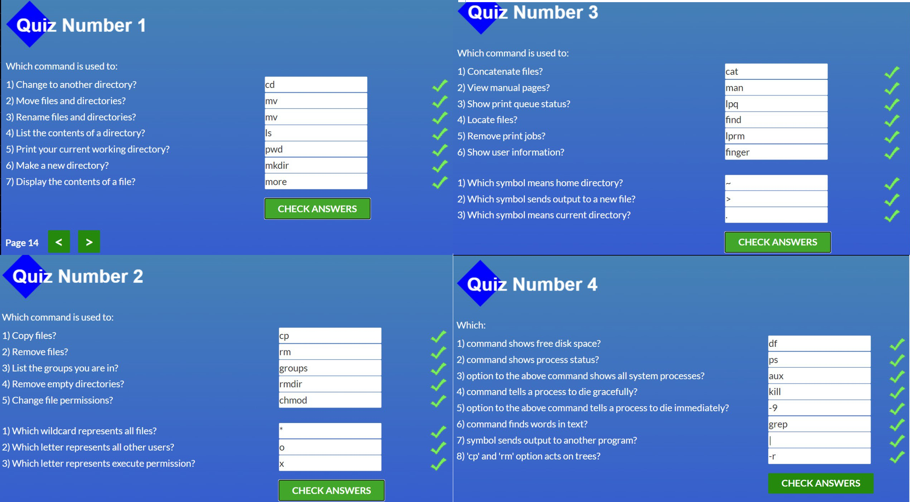

# kottans-frontend

## Git & Github

Passing the course from kottans front-end
Now i can say that the course is well written and structured.

Although I've only just started going through it, I've already learned a lot.
I liked the preparation process and practical tasks. I hope this will help me finish all the tasks in time.

A lot of the material was new to me;
Surprised how many options there are to solve the problem;
I will use the command git pool  the most in the future);

<sup> Thank you for the opportunity, I will continue </sup>


## Linux CLI, and HTTP
<details><summary> Click to expand Screenshots from Linux Survival </summary>



</details>

- The concept of HTTP Reques was completely new to me. Although I did not remember everything to the end, I understood the principle. I will try harder to remember.
- Surprised at how easy it was to do the Linux Survival exercises.
- In the future, I want to work more with HTTP Request. I hope to improve the knowledge about him


## Git Collaboration
<details><summary> Click to expand Screenshots from coursera 3 & 4 weeks </summary>


</details>
<details><summary> Click to expand Screenshots from  learngitbranching </summary>


</details>

- New for me this time was the flexibility of commits.
- I was surprised by git ability to catch errors.
- In the future, I will use the knowledge of git rebase and as much information as possible from this step of the course.

## Intro to HTML and CSS

<details><summary> Click to expand Screenshots for Intro to HTML & CSS  </summary>


</details>
<details><summary> Click to expand Screenshots from  codeAcademy </summary>


</details>

- New was calling child selectors through parents.
- I was surprised by the variety of approaches to creating color.
- I will use Twitter Bootstrap more in the future

## Responsive Web Design
<details><summary> Click to expand Screenshots from Flexbox froggy </summary>


</details>
<details><summary> Click to expand Screenshots from Grid garden </summary>


</details>

- Always well-chosen material. Special thanks for the material not in English)).
- A very cool combination of units of value. Example `grid-template: 50px 20% 1fr`.
- Confident use of `grid layout` and `flexbox` is guaranteed.

<details><summary> Better reference material (saw the info in @github/vl-shevchenko) </summary>

- ` viewport` - Метатег viewport дает браузеру инструкции по управлению размерами и масштабированием страницы.
- `width=device-width` - Значение метатега viewport width=device-width предписывает странице соответствовать ширине экрана в аппаратно-независимых пикселях.
- `initial-scale=1`- предписывает браузерам устанавливать соотношение 1:1 между пикселями CSS и аппаратно-независимыми пикселями, независимо от ориентации устройства, что позволяет странице использовать всю ширину альбомной ориентации.

```
<!DOCTYPE html>
<html lang="en">
<head>
  …
  <meta name="viewport" content="width=device-width, initial-scale=1">
  …
</head>
```

### `justify-content` - выравнивает элементы горизонтально и принимает следующие значения:<br>
   - `flex-start` Элементы выравниваются по левой стороне контейнера.<br>
   - `flex-end` Элементы выравниваются по правой стороне контейнера.<br>
   - `center` Элементы выравниваются по центру контейнера.<br>
   - `space-between` Элементы отображаются с одинаковыми отступами между ними.<br>
   - `space-around` Элементы отображаются с одинаковыми отступами вокруг них.<br>
   - `stretch` Ряды растягиваются, чтоб заполнить контейнер равномерно.<br>

### `align-items` - Это CSS свойство выравнивает элементы вертикально и принимает следующие значения:<br>
   - `flex-start` Элементы выравниваются по верхнему краю контейнера.<br>
   - `flex-end` Элементы выравниваются по нижнему краю контейнера.<br>
   - `center` Элементы выравниваются вертикально по центру контейнера.<br>
   - `baseline` Элементы отображаются на базовой линии контейнера.<br>
   - `stretch` Элементы растягиваются, чтоб заполнить контейнер.

### `flex-direction` то CSS свойство задает направление, в котором будут расположены элементы в контейнере, и принимает следующие значения:<br>
   - `row` элементы размещаются по направлению текста.<br>
   - `row-reverse` элементы отображаются в обратном порядке к направлению текста.<br>
   - `column` элементы располагаются сверху вниз.<br>
   - `column-reverse` элементы располагаются снизу вверх.

### `order` изменениe порядка отображения элементов в контейнере

### `flex-wrap` переносит в след ряд<br>
   - `nowrap` Размеры элементов устанавливаются автоматически, чтоб они поместились в один ряд.<br>
   - `wrap` Элементы автоматически переносятся на новую строку.<br>
   - `wrap-reverse` Элементы автоматически переносятся на новую строку, но строки расположены в обратном порядке.

> `flex-flow = flex-direction + flex-wrap`


> `align-content` отвечает за расстояние между рядами, в то время как `align-items` отвечает за то,
как элементы в целом будут выровнены в контейнере. Когда только один ряд, `align-content` ни на что не влияет.

</details>